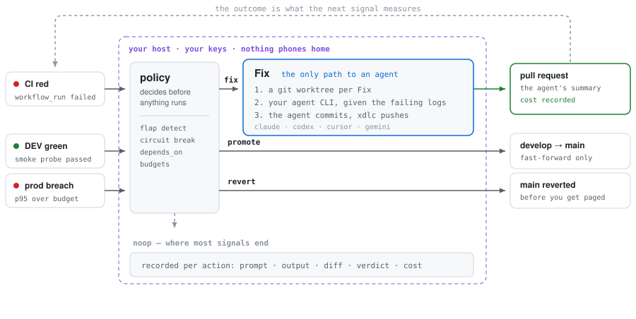
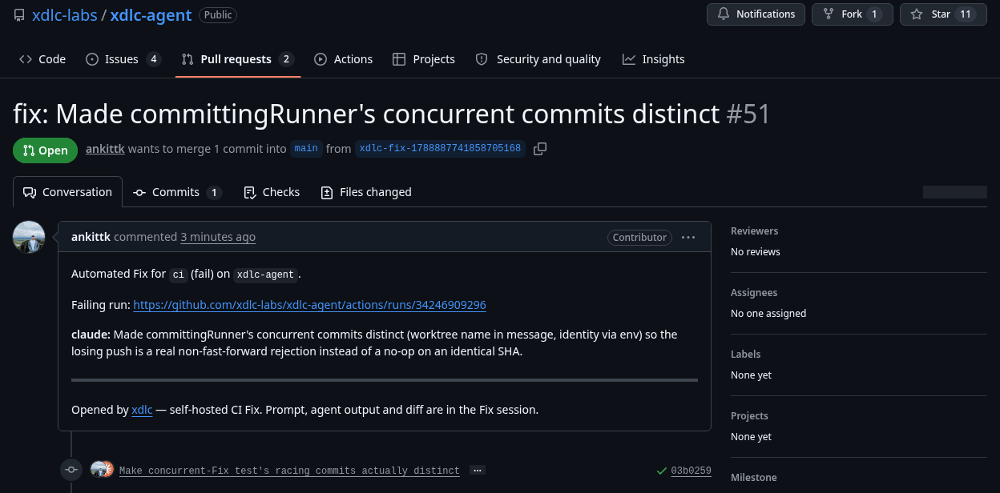

<p align="center">
  
</p>

<p align="center">
  <strong>xdlc</strong>
</p>

<p align="center">
  <strong>Your CI went red at 3am.<br>It stayed red until somebody woke up and read the logs.</strong>
</p>

<p align="center">
  <a href="https://github.com/xdlc-labs/xdlc-agent/actions/workflows/ci.yml"></a>
  <a href="https://github.com/xdlc-labs/xdlc-agent/releases"></a>
  <a href="go.mod"></a>
  <a href="LICENSE"></a>
</p>

---

You already pay for a coding agent that could have read those logs. What is missing is
the part that notices the failure, hands the agent the right context, keeps it away from
your working tree, pushes the result, and leaves a record of what it was told and what it
cost. Doing that by hand at 9am is not the hard part. Doing it unattended, safely, is.

xdlc is that part, self-hosted. A failed GitHub Actions run becomes a **Fix**: your agent
CLI gets the failing job's logs and the repo's own conventions, works in a throwaway git
worktree, commits, and xdlc pushes and opens the pull request.

<p align="center">
  <picture>
    <source media="(prefers-color-scheme: dark)" srcset="docs/assets/loop-dark.svg">
    
  </picture>
</p>

**The agent never decides whether it runs. Policy does.** That is the difference between
this and a bot on a webhook. Three signals go in, one of four verdicts comes out, and only
one of them reaches a coding agent at all. A Fix that committed nothing is recorded as
exactly that, never as a success.

- **Your agent, your keys.** `claude`, `codex`, `cursor` or `gemini` on `PATH`. Nothing phones home; there is no SaaS in the path.
- **It stays out of your tree.** Every Fix gets its own `git worktree` on a scratch branch. The agent commits; xdlc pushes. A run killed mid-edit cannot dirty a clone.
- **Receipts, not vibes.** The prompt, the agent's stdout, the diff and its verdict are on disk for every Fix, with tokens and cost whenever the agent CLI reports them, as `claude` does.

## Install

Linux and macOS, `amd64` and `arm64`.

```bash
curl -fsSL https://raw.githubusercontent.com/xdlc-labs/xdlc-agent/main/scripts/install.sh | bash
export PATH="$HOME/.local/bin:$PATH"   # if needed
xdlc demo
```

<p align="center">
  
</p>

`xdlc demo` builds a throwaway repo with a failing test and runs the whole loop against it:
Fix, then a promote, then a revert on a simulated prod breach. The agent in that recording
is real `claude`, but the bug is a toy one, so treat it as a tour of the mechanics and
[#51](https://github.com/xdlc-labs/xdlc-agent/pull/51) as the evidence. Reproduce it with
`bash docs/assets/demo.sh`, or run `xdlc demo --provider fake` to see the same loop with no
API key at all — a stub agent that writes a canned patch, which exercises the worktree, the
push and the gate re-check, and nothing about the agent.

This is a public beta, so every release is a pre-release and GitHub's "latest" link skips
them. Pin one with `XDLC_VERSION=v0.0.1-beta.5`, or pick a tag from
[Releases](https://github.com/xdlc-labs/xdlc-agent/releases).

The CLI is `xdlc`. The container image, Helm chart and this repository are `xdlc-agent`.

## Fix one real failed run

No daemon, no webhook, no config file. Point it at a red run:

```bash
gh auth login                        # or export GITHUB_TOKEN=...
npm i -g @anthropic-ai/claude-code   # or codex / cursor-agent / gemini
xdlc fix https://github.com/you/repo/actions/runs/123456789
```

Here is one that happened. This project's own CI was red on a flaky concurrency test, so
`xdlc fix` was pointed at the failing run. The agent found that two Fixes committing inside
the same second produced identical SHAs, which made the losing push a silent no-op, and
wrote the patch. That is
[#51](https://github.com/xdlc-labs/xdlc-agent/pull/51) on this repository, green checks and
all. It cost $1.63, and that is close to the worst case: the run used Claude Fable 5.1, the
priciest model on offer. The same work prices out at **$1.13 on Opus 5 and $0.45 on
Sonnet 5**, which `--model` selects. Its output, wrapping the agent's summary and showing the
default cache paths:

```console
github auth: GITHUB_TOKEN
run: ci on main@a72d02f → failure
agent: claude, mode: pr, clone: ~/.cache/xdlc/repos/xdlc-labs/xdlc-agent
fixing… (a real agent usually takes 2–10 minutes)
agent said: Made committingRunner's concurrent commits distinct (worktree name in
  message, identity via env) so the losing push is a real non-fast-forward rejection
  instead of a no-op on an identical SHA.
cost: $1.63
session: xdlc sessions show 20260908T171541Z-xdlc-agent --diff
PR: https://github.com/xdlc-labs/xdlc-agent/pull/51
```

<p align="center">
  <a href="https://github.com/xdlc-labs/xdlc-agent/pull/51"></a>
</p>

It exits non-zero when the run is not actually red, when the agent committed nothing, or
when the pull request could not be opened, so a job wrapping it fails visibly instead of
reporting a Fix that never happened.

`--provider` picks the agent CLI and `--model` picks the model it asks for, which is the
lever that actually moves the bill. `--mode direct` pushes to the failing branch instead of
opening a pull request. `-m "the flake is in the seed data"` adds a hint to the prompt's
trusted block.

```bash
xdlc fix <run-url> --provider claude --model claude-sonnet-5
```

Every run writes a session: the exact prompt, the agent's stdout, the diff, its own verdict,
and the cost.

```bash
xdlc sessions show 20260908T171541Z-xdlc-agent --diff
```

## Use it on your repo

The one-repo on-ramp. A second workflow fires when your CI fails:

```yaml
# .github/workflows/xdlc-fix.yml
name: xdlc fix
on:
  workflow_run:
    workflows: [ci]          # the name of your CI workflow
    types: [completed]
permissions:
  contents: write
  pull-requests: write
  actions: read
jobs:
  fix:
    if: github.event.workflow_run.conclusion == 'failure'
    runs-on: ubuntu-latest
    steps:
      - uses: xdlc-labs/xdlc-agent@main
        with:
          provider: claude
        env:
          ANTHROPIC_API_KEY: ${{ secrets.ANTHROPIC_API_KEY }}
```

Turn on **Settings → Actions → Allow GitHub Actions to create and approve pull requests**,
or pass a PAT as `github-token`. This is one Fix per failure and nothing else: no fleet
state, no promote, no revert, no console.

## Or run the daemon

Unattended, across repos, with policy in front of the agent:

```bash
xdlc init
# edit config.yaml: repos[].github + agent.provider (gates stay [ci])
export XDLC_API_TOKEN="$(openssl rand -hex 32)"
export GITHUB_TOKEN=...              # or a GitHub App, preferred
xdlc doctor --config config.yaml --skip-network
xdlc daemon --config config.yaml
```

Open http://127.0.0.1:8080/ → **Settings** → paste the same `XDLC_API_TOKEN`. The console is
embedded on the same port as `/api/*`. Full walkthrough:
[Getting started](https://xdlc.dev/agent/docs/getting-started).

<details>
<summary><strong>Docker</strong></summary>

A container always binds a non-loopback address, so the container path needs
`server.require_webhook_secret: true` in `config.yaml` plus a `GITHUB_WEBHOOK_SECRET` in the
environment. The daemon refuses to start without it. If `docker pull` returns
`unauthorized`, the GHCR package is not public yet — `docker login ghcr.io` or build from
source.

```bash
# config.yaml for the container: addr: ":8080" + require_webhook_secret: true
export GITHUB_WEBHOOK_SECRET=...     # same secret as the GitHub webhook
docker run --rm -p 8080:8080 \
  -v "$PWD/config.yaml:/etc/xdlc-agent/config.yaml:ro" \
  -e XDLC_API_TOKEN -e GITHUB_TOKEN -e GITHUB_WEBHOOK_SECRET \
  -e ANTHROPIC_API_KEY -e OPENAI_API_KEY -e CURSOR_API_KEY \
  ghcr.io/xdlc-labs/xdlc-agent:0.0.1-beta.5 \
  daemon --config /etc/xdlc-agent/config.yaml
```
</details>

<details>
<summary><strong>Helm</strong></summary>

Single replica: the audit DB is single-writer.

```bash
helm install xdlc-agent deploy/helm/xdlc-agent \
  --set image.tag=0.0.1-beta.5 \
  --set existingSecret=xdlc-agent-secrets \
  --set-file config=config.yaml
```
</details>


## How it works

The diagram at the top is the logic. This is the deployment it runs in — one daemon beside
your repos, taking webhooks and polling, from the
[architecture](https://xdlc.dev/agent/docs/architecture) page.


1. GitHub reports a failed `workflow_run` — or you run `xdlc fix` by hand, or enable DEV smoke and prod health later.
2. The daemon validates the webhook and asks policy what to do.
3. **Fix** runs your agent CLI against the failing logs and the repo's conventions (`AGENTS.md`, `CLAUDE.md`, `.xdlc/rules.md`, `.xdlc/skills/*.md`), in a fresh worktree on an `xdlc/<session>` branch. The agent commits; xdlc pushes.
4. Evidence lands in the console, the audit store, `BACKLOG.md` and `xdlc sessions show`.

The default install is **CI Fix** only. GitOps promote and prod revert are opt-in; see
[Optional profiles](https://xdlc.dev/agent/docs/production-loop).

## What it does, and what it does not

| xdlc handles | Keep using |
|---|---|
| A red `workflow_run` becoming a reviewed pull request, unattended | GitHub Actions for the CI itself |
| Keeping the agent out of your working tree (worktree per Fix, xdlc owns the push) | Your agent's own interactive mode for work you are watching |
| Recording the prompt, output, diff, verdict and cost of every Fix | Your eval or observability stack |
| Fleet policy across repos: flap detection, circuit breaking, `depends_on` suppression | Flagger or Argo Rollouts for traffic shifting |
| Optional fast-forward `develop` → `main` after DEV smoke, and reverting `main` on a prod SLO breach | Your existing deploy tooling, if it already does this |

A Fix that committed nothing is recorded as exactly that, never as a success. That
distinction was a bug once ([#34](https://github.com/xdlc-labs/xdlc-agent/issues/34)) and it
is the one an unattended loop most needs to get right.

**Fixes in the wild.** Every pull request xdlc opens on this repository stays linked here,
cost included, so the claims above have receipts rather than adjectives.

| Pull request | Repo | Agent | Model | Cost | What broke |
|---|---|---|---|---|---|
| [#51](https://github.com/xdlc-labs/xdlc-agent/pull/51) | `xdlc-agent` | `claude` | Fable 5.1 | $1.63 | Two concurrent Fixes committed identical SHAs in the same second, so the losing push was a silent no-op |

### What a Fix costs

Cost is the agent CLI's own `total_cost_usd` at list API prices, so a subscription plan pays
less at the margin than the number recorded. Almost none of it is fresh input. That Fix
billed 514 uncached input tokens against 49,801 cache writes, 843,579 cache reads and 8,351
of output, so the bill is mostly cache traffic and the model's rate on it is what moves the
total:

| Model | Rate in / out per MTok | Same Fix costs |
|---|---|---|
| Claude Fable 5.1 | $10 / $50 | $1.63 (measured) |
| Claude Opus 5 | $5 / $25 | $1.13 |
| Claude Sonnet 5 | $2 / $10 | $0.45 |
| Claude Haiku 4.5 | $1 / $5 | $0.23 |

Only the first row was measured. The rest reprice those exact token counts at each model's
published rates, including the 2x one-hour cache write and the 0.1x cache read (0.025x on
Fable 5.1, which is why it is closer to Opus than its headline rate suggests). Treat them as
the shape of the bill, not a promise: a different model will not spend the same tokens on the
same bug, and a Fix that needs two attempts costs both.

## If you already use Copilot Autofix, or a coding-agent Action

Copilot Autofix fixes security and dependency findings, inside GitHub, with GitHub's model.
xdlc fixes whatever turned your CI red, with the agent you chose, on hardware you control.

A Claude Code or Codex GitHub Action is roughly `xdlc fix` in a workflow, which is why that
wrapper ships here too. The daemon adds what a job cannot have: a loop that outlives the
job, state shared across repos, policy ahead of the agent, and the promote and revert legs.
The reasoning is in
[why not a GitHub Action](https://xdlc.dev/agent/docs/why-not-github-action).

## What is in the box

`fix` runs one Fix from a run URL. `daemon` runs the loop: webhooks, pollers, policy,
console. `demo` runs the whole thing against a throwaway repo. `init` and `doctor` write and
check a config. `sessions` lists and shows recordings. `gate`, `promote` and `history` are
the one-shot pieces the daemon composes. `validate` checks a config in CI.

Four agent providers (`claude`, `codex`, `cursor`, `gemini`), each with a headless default
invocation you can override. Cheapest-first provider routing, a retry ladder gated on a real
re-check, per-Fix budgets and concurrency caps.

## Status

Public beta. Expect CLI churn before 1.0. No telemetry, no hosted control plane, nothing
uploads. Promote and revert assume `develop` → `main` fast-forward plus ArgoCD and
Prometheus, and are off unless you turn them on.

Shipping prompts, skills, MCP servers or model pins? [Airlock](https://github.com/xdlc-labs/airlock)
is the release gate for those.

[Docs](https://xdlc.dev/docs) ·
[Getting started](https://xdlc.dev/agent/docs/getting-started) ·
[Roadmap](ROADMAP.md) ·
[Changelog](CHANGELOG.md) ·
[Contributing](CONTRIBUTING.md) ·
[Security](SECURITY.md) ·
[MIT](LICENSE)
