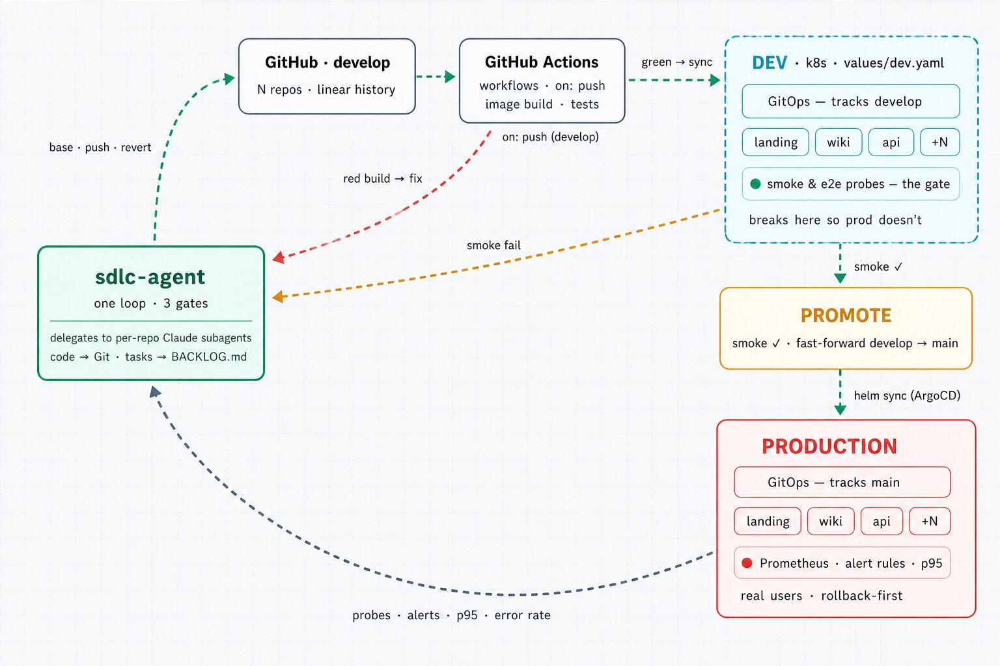
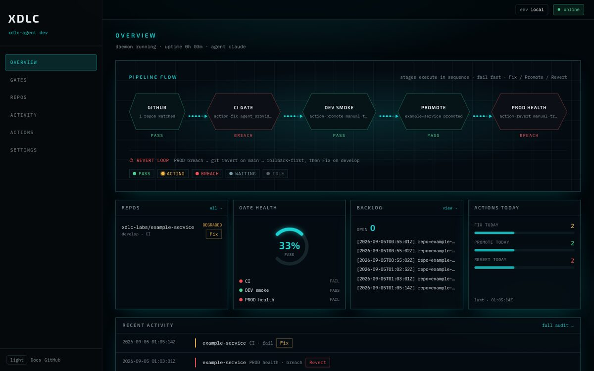
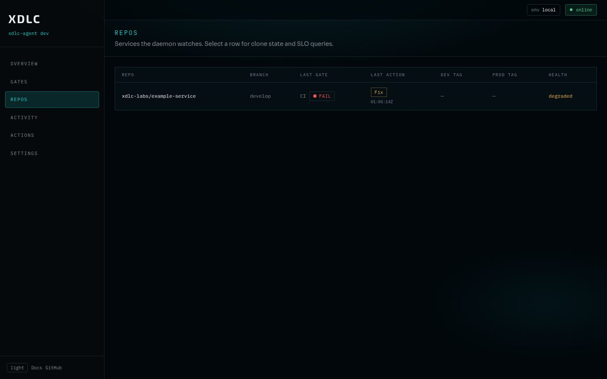
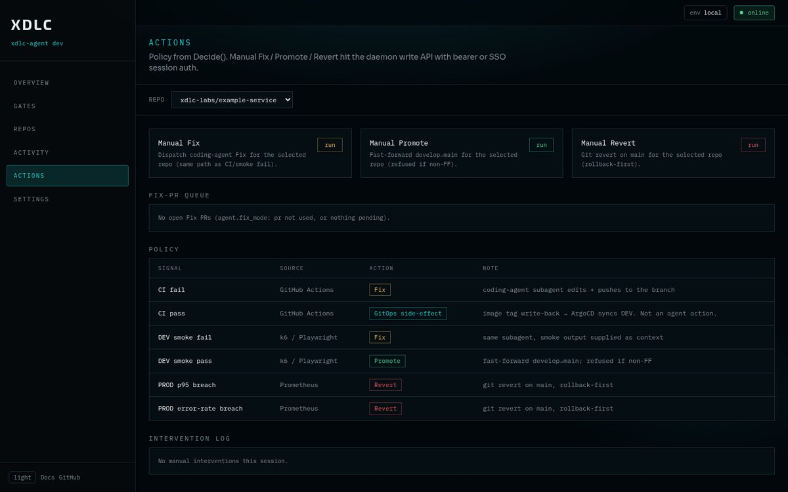

# xdlc-agent

Self-hosted **agentic delivery loop**. One Go daemon watches your repos, then **Fix** / **Promote** / **Revert** under policy — with your coding agent (`claude`, `codex`, or `cursor`). MIT. You run it; no SaaS in the loop.

[](https://github.com/xdlc-labs/xdlc-agent/actions/workflows/ci.yml)
[](https://github.com/xdlc-labs/xdlc-agent/releases)
[](LICENSE)



| Signal | Action |
|--------|--------|
| CI fail | **Fix** — coding-agent subagent (gets run URL / logs) |
| DEV smoke fail | **Fix** — probe logs → subagent |
| DEV smoke pass | **Promote** — fast-forward `develop` → `main` |
| PROD p95 / error-rate breach | **Revert** — `git revert` on `main` |

Green CI → DEV is your GitOps path (image tag + Argo CD), not an agent action. Design notes: [docs/architecture.md](docs/architecture.md).

### Ops console

Embedded at `/` when the daemon runs (image ships the UI; local builds need `cd ui && bun run build` first). On **401**, paste your `XDL_API_TOKEN` in the banner.







---

## Prerequisites

| Need | Why |
|------|-----|
| Go 1.25+ **or** Docker / Kubernetes | Build binary or run published image |
| GitHub App (preferred) or PAT | Clone, push, CI status, optional PRs |
| Coding-agent CLI + API key | Fix actions (`claude` / `codex` / `cursor-agent`) |
| Repos with `develop` + `main` | Promote is ff-only `develop` → `main` |
| Optional: Argo CD + Prometheus | DEV smoke + PROD health gates |

---

## Quick start (binary)

```sh
git clone https://github.com/xdlc-labs/xdlc-agent.git
cd xdlc-agent

go build -o bin/xdlc-agent ./cmd/xdlc-agent

# starter config.yaml (or: cp config.example.yaml config.yaml)
./bin/xdlc-agent init
# edit config.yaml — set repos[].github, gates, agent.provider

./bin/xdlc-agent validate --config config.yaml
```

Export secrets (names match `config.example.yaml`):

```sh
# GitHub — App preferred; PAT is fine for a first run
export GITHUB_TOKEN=ghp_...                    # or App envs below
# export GITHUB_APP_ID=...
# export GITHUB_APP_INSTALLATION_ID=...
# export GITHUB_APP_PRIVATE_KEY="$(cat app.pem)"

export GITHUB_WEBHOOK_SECRET=...               # must match GitHub webhook
# export ARGOCD_WEBHOOK_SECRET=...
# export ALERTMANAGER_WEBHOOK_SECRET=...

export XDL_API_TOKEN=...                       # operator token for /api/* writes
export ANTHROPIC_API_KEY=...                   # if agent.provider: claude
# export OPENAI_API_KEY=...                    # if codex
# export CURSOR_API_KEY=...                    # if cursor
```

Run:

```sh
./bin/xdlc-agent daemon --config config.yaml
```

- Console + API: `http://127.0.0.1:8080/` (UI needs a prior `cd ui && bun install && bun run build`, or use the published image which already embeds it)
- Health: `GET /api/health`
- Point GitHub `workflow_run` (and optional Argo CD / Alertmanager) webhooks at `http://<host>:8080/webhooks/github` (and siblings)

Useful commands:

```sh
./bin/xdlc-agent history
./bin/xdlc-agent backlog list
./bin/xdlc-agent gate check ci --config config.yaml
```

---

## Docker

Published image embeds the ops console.

```sh
docker run --rm -p 8080:8080 \
  -v "$PWD/config.yaml:/etc/xdlc-agent/config.yaml:ro" \
  -e GITHUB_TOKEN \
  -e GITHUB_WEBHOOK_SECRET \
  -e XDL_API_TOKEN \
  -e ANTHROPIC_API_KEY \
  ghcr.io/xdlc-labs/xdlc-agent:2.0.0 \
  daemon --config /etc/xdlc-agent/config.yaml
```

---

## Helm

```sh
# Secret with the env keys your config references (never put tokens in values.yaml)
kubectl create secret generic xdlc-agent-secrets \
  --from-literal=GITHUB_TOKEN="$GITHUB_TOKEN" \
  --from-literal=GITHUB_WEBHOOK_SECRET="$GITHUB_WEBHOOK_SECRET" \
  --from-literal=XDL_API_TOKEN="$XDL_API_TOKEN" \
  --from-literal=ANTHROPIC_API_KEY="$ANTHROPIC_API_KEY"

helm install xdlc-agent deploy/helm/xdlc-agent \
  --set image.tag=2.0.0 \
  --set existingSecret=xdlc-agent-secrets \
  --set-file config=config.yaml
```

Chart defaults: `replicaCount: 1`, config via values/`--set-file`, secrets via `existingSecret`. See [deploy/helm/xdlc-agent/values.yaml](deploy/helm/xdlc-agent/values.yaml).

---

## Configure the loop

Minimal shape (full comments in [config.example.yaml](config.example.yaml)):

```yaml
repos:
  - name: my-service
    github: your-org/my-service
    gates: [ci, dev-smoke, prod-health]
    argocd_app: dev-my-service   # Argo CD Application name for DEV smoke
    probe_job: smoke-e2e

gates:
  ci:
    trigger: on_push
  dev-smoke:
    trigger: on_sync
    namespace: dev
  prod-health:
    trigger: continuous
    metrics_url: http://prometheus.example.svc:9090
    thresholds: { p95_ms: 500, error_rate: 0.01 }

agent:
  provider: claude   # claude | codex | cursor
  timeout: 10m

server:
  addr: ":8080"
  github_webhook_secret_env: GITHUB_WEBHOOK_SECRET
  # api_token_env: XDL_API_TOKEN
```

| Provider | CLI on `PATH` | API key env |
|----------|---------------|-------------|
| `claude` (default) | `claude` | `ANTHROPIC_API_KEY` |
| `codex` | `codex` | `OPENAI_API_KEY` |
| `cursor` | `cursor-agent` | `CURSOR_API_KEY` |

Override `agent.binary` / `agent.args` if your CLI flags differ.

---

## What you still wire yourself

This repo is the **daemon**. Your cluster still needs:

1. CI that fails loudly on `develop` (GitHub Actions / etc.)
2. Deploy path: green build → DEV (usually GitOps image-tag write-back + Argo CD)
3. Optional smoke Job in the DEV namespace (`probe_job`)
4. Prometheus (or any PromQL API) for PROD health
5. Webhooks from GitHub (and Argo CD / Alertmanager if you use those gates)

`validate --gitops-dir <path>` can cross-check `argocd_app` names against an Argo CD app-of-apps tree if you keep one nearby.

---

## Develop

```sh
make test
make build
cd ui && bun install && bun run build   # embed console before local go build
```

[docs/CONTRIBUTING.md](docs/CONTRIBUTING.md) · [docs/SECURITY.md](docs/SECURITY.md) · [docs/CHANGELOG.md](docs/CHANGELOG.md)

```
cmd/xdlc-agent/   CLI + daemon
internal/         orchestrator, gates, dispatch, API, store, …
ui/               ops console (embedded at /)
deploy/helm/      agent chart
docs/             architecture, contributing, security, changelog
```
