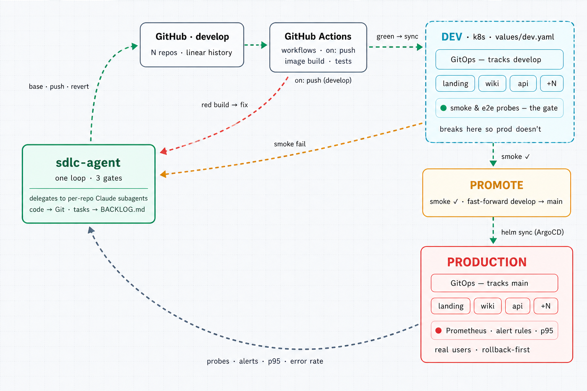

# xdlc

[](https://github.com/xdlc-labs/xdlc-agent/actions/workflows/ci.yml)
[](https://github.com/xdlc-labs/xdlc-agent/releases)
[](go.mod)
[](https://goreportcard.com/report/github.com/xdlc-labs/xdlc-agent)
[](LICENSE)
[](CONTRIBUTING.md)

**xdlc** is an agentic platform-engineering loop. Binary is `xdlc-agent`:
one orchestrator, three pluggable gates (CI, DEV smoke/e2e, PROD health),
fast-forward-only promotion, rollback-first production feedback. Daemon
watches repos, pushes fixes when CI goes red, blocks a bad deploy before
prod, and reverts when p95 or error rate breaches — single Go binary,
MIT-licensed, no SaaS in the loop.

| | |
|---|---|
| Product / repo / image | `xdlc` (`ghcr.io/xdlc-labs/xdlc-agent`) |
| Binary / Helm chart / Deployment | `xdlc-agent` |
| Local Kind cluster / k8s namespace | `xdlc` |
| Local ingress domain | `*.xdlc.local` |



## Why

Most "agentic SDLC" today means a human pasting logs into a chat
window. This is the opposite bet: a daemon that receives the signal
(red build, failed smoke test, breached SLO) and *is already the thing
that responds*, no human in the loop for the routine case, full audit
trail (`BACKLOG.md` + `xdlc-agent history`) for the case that needs one.

**What this is for:** standardized, routine SDLC signals with a known
shape — a red build, a failed smoke probe, a breached SLO — where "what to
do" is a policy decision, not a design decision. **What this isn't for:**
novel feature work, architectural decisions, or anything needing creative
exploration; point a human (or an interactive coding-agent session) at
those instead. It fits best where CI/CD discipline already exists —
gates to trust, a fix-forward branch model to trust the promote path
against.

## Bring your own agent

The subagent that actually edits and pushes code is pluggable, not
hardcoded to one vendor. `agent.provider` in `config.yaml` picks
between:

| Provider | CLI | Headless invocation |
|---|---|---|
| `claude` (default) | Claude Code | `claude -p <prompt> --output-format json` |
| `codex` | OpenAI Codex CLI | `codex exec <prompt>` |
| `cursor` | Cursor CLI | `cursor-agent -p <prompt>` |

Override `agent.binary`/`agent.args` for a wrapper script or a CLI whose
flags have moved on from what's baked in here. See
`internal/subagent` and [docs/architecture.md](docs/architecture.md).

## How it works

| Signal | Action |
|---|---|
| CI fail | **Fix**: per-repo coding-agent subagent (run URL in evidence; subagent fetches logs) |
| DEV smoke fail | **Fix**: probe logs go to the subagent |
| DEV smoke pass | **Promote**: fast-forward `develop` → `main`; ArgoCD syncs prod as a side-effect |
| PROD p95 / error-rate breach | **Revert**: `git revert` on `main` (ArgoCD rolls prod back; `develop` is realigned when it still matched the pre-revert `main` tip) |

Green CI → DEV is a GitOps side-effect (image tag write-back + ArgoCD),
not an agent action. Full loop design: [docs/architecture.md](docs/architecture.md).

## Try it

**Full loop (Kind + ArgoCD + Prometheus + OTel)**: needs Docker, a GitHub
App (or PAT), and an API key for whichever `agent.provider` you use. Cold
bootstrap is not a 15-minute toy; plan for cluster install time.

```sh
git clone https://github.com/xdlc-labs/xdlc-agent.git
cd xdlc
make setup          # or ./scripts/setup.sh
# export GitHub App envs (or GITHUB_TOKEN), GITHUB_WEBHOOK_SECRET,
# plus your agent's key (ANTHROPIC_API_KEY / OPENAI_API_KEY / CURSOR_API_KEY)
make bootstrap      # or ./scripts/bootstrap-local.sh
```

Step-by-step (webhooks, exercising each gate): [docs/getting-started.md](docs/getting-started.md).

**Binary only** (contributors / config validation):

```sh
go build -o bin/xdlc-agent ./cmd/xdlc-agent
./bin/xdlc-agent init
./bin/xdlc-agent validate --config config.yaml --gitops-dir gitops
./bin/xdlc-agent daemon
./bin/xdlc-agent history
```

Or via Docker / Helm:

```sh
# A mounted config is not enough: the daemon fails at startup without
# git credentials, and protected /api/* routes 503 without an operator
# token. Swap GITHUB_TOKEN for the GitHub App envs where you have them.
docker run --rm -p 8080:8080 \
  -v "$PWD/config.yaml:/etc/xdlc-agent/config.yaml" \
  -e GITHUB_TOKEN \
  -e GITHUB_WEBHOOK_SECRET \
  -e XDL_API_TOKEN \
  -e ANTHROPIC_API_KEY \
  ghcr.io/xdlc-labs/xdlc-agent:2.0.0 daemon --config /etc/xdlc-agent/config.yaml

helm install xdlc-agent deploy/helm/xdlc-agent -f my-values.yaml
```

`ANTHROPIC_API_KEY` matches `agent.provider: claude`; use
`OPENAI_API_KEY` for `codex` or `CURSOR_API_KEY` for `cursor`. Full
env table: [docs/secrets.md](docs/secrets.md).

## Features

- **Real dispatch, not a demo**: `git revert`, fast-forward promote, and
  a per-repo coding-agent subagent against real repos
  (`internal/dispatch` tests use bare git repos, not mocks)
- **Bring your own agent**: Claude Code, OpenAI Codex, Cursor, or your
  own wrapper, see [docs/architecture.md](docs/architecture.md)
- **Three built-in gates**, each swappable: GitHub Actions CI, ArgoCD +
  k6/Playwright smoke/e2e, Prometheus p95/error-rate. Implement
  `gate.Gate` for your own stack
- **`xdlc-agent validate`**: catches `config.yaml` drift against
  `gitops/` before a gate silently breaks
- **Helm chart + multi-arch Docker image** for the agent; a second chart
  (`helm/service-template`) for the services it gates
- **Ops console** (`ui/`): OIDC-authed dashboard + Fix/Promote/Revert
  dispatch over `/api/*`, bundled into the agent binary — see
  [docs/console.md](docs/console.md)
- Design tradeoffs written down, see [docs/gates.md](docs/gates.md)'s
  wiring notes and [docs/architecture.md](docs/architecture.md)'s "vs
  the diagram" section

## Project structure

```
xdlc/
├── cmd/xdlc-agent/         # CLI entrypoint: daemon, gate, validate, promote, backlog, history, init
├── internal/               # daemon internals: orchestrator, gate/gatebuild, dispatch, subagent,
│                           #   api + authn, console (embeds ui/dist), store, poller, webhook, ...
├── ui/                     # ops console — React + Vite SPA, embedded via internal/console
├── deploy/                 # Dockerfile (dev, embeds ui/) + Dockerfile.release, Helm chart for the agent
├── helm/service-template/  # Helm chart for the services xdlc gates (not the agent itself)
├── gitops/                 # ArgoCD app-of-apps manifests: root-dev.yaml, root-prod.yaml, clusters/
├── infra/                  # Terraform starters: aws-eks/, gcp-gke/, azure-aks/
├── scripts/                # setup.sh, bootstrap-local.sh, bootstrap-cloud/{aws,gcp,azure}.sh
├── observability/          # Prometheus rules, Grafana dashboards, OTel collector config
├── services/example-service/ # sample service the daemon gates, for local bootstrap
├── docs/                   # everything in the table below
└── config.example.yaml     # annotated config.yaml reference
```

## Documentation

| Doc | Covers |
|---|---|
| [docs/getting-started.md](docs/getting-started.md) | Fork → Kind bootstrap → webhooks → exercise 3 gates |
| [docs/local-setup.md](docs/local-setup.md) | Kind / Minikube day-2, hosts, troubleshooting |
| [docs/deployment.md](docs/deployment.md) | Helm install agent, RBAC, PVC, webhooks, PromQL |
| [docs/secrets.md](docs/secrets.md) | Daemon secret inventory; ESO / Sealed Secrets / Vault |
| [docs/capacity.md](docs/capacity.md) | Repos per daemon, knobs, PVC/CPU, tenancy (one daemon per trust domain) |
| [docs/console.md](docs/console.md) | Ops UI + `/api/*` |
| [docs/runbook.md](docs/runbook.md) | Decide policy, fix/promote/revert, audit, intervene |
| [docs/service-onboarding.md](docs/service-onboarding.md) | Add a service end-to-end |
| [docs/architecture.md](docs/architecture.md) | Loop, vs diagram, clones, git auth, image |
| [docs/gates.md](docs/gates.md) | `Gate` interface, 3 built-ins, validate, add a gate |
| [docs/gitops.md](docs/gitops.md) | App-of-apps, values, promote / image-tag path |
| [docs/upgrade.md](docs/upgrade.md) | SemVer compatibility + version-to-version migrations |
| [docs/api-reference.md](docs/api-reference.md) | `/api/*` schemas + errors |
| [docs/disaster-recovery.md](docs/disaster-recovery.md) | Backup/restore, RPO/RTO, HA (not implemented) |
| [docs/threat-model.md](docs/threat-model.md) | Trust boundaries (daemon vs subagent) |
| [GOVERNANCE.md](GOVERNANCE.md) | Maintainer model, support stance, decisions, CoC pointer |
| [SECURITY.md](SECURITY.md) | Credentials, compliance (not assessed), vulnerability reports |
| [CHANGELOG.md](CHANGELOG.md) | Release history, breaking renames |
| [CODE_OF_CONDUCT.md](CODE_OF_CONDUCT.md) | Community expectations |

## Status

Core loop is wired end to end and tested against real infrastructure:
real git for dispatch, HMAC webhooks, bbolt audit, `helm template`
charts, `go test -race` in CI.

Honest MVP limits (see [architecture § vs the diagram](docs/architecture.md#vs-the-diagram)):

- Pollers remain edge-triggered fallback when ArgoCD / Alertmanager
  webhooks are quiet
- Prod-health queries support `{{repo}}` for per-service SLOs; per-repo
  threshold overrides via `repos[].thresholds`
- CI Fix pulls a truncated failed-job log excerpt when the GitHub API allows
- Promote copies `values/dev` → `values/prod` tag; revert targets `main`
- Ops console dispatches Fix/Promote/Revert via authenticated `/api/*`
  writes and ships bundled in the agent image (see [docs/console.md](docs/console.md))
- Single replica only — no leader election / networked audit store yet,
  see [docs/disaster-recovery.md](docs/disaster-recovery.md#high-availability-not-implemented)

Check [open issues](https://github.com/xdlc-labs/xdlc-agent/issues) for
what's still missing before you run this against real production traffic.

## Contributing

PRs welcome, see [CONTRIBUTING.md](CONTRIBUTING.md),
[GOVERNANCE.md](GOVERNANCE.md), and [CODE_OF_CONDUCT.md](CODE_OF_CONDUCT.md).
Anything labelled
[good first issue](https://github.com/xdlc-labs/xdlc-agent/issues?q=is%3Aissue+is%3Aopen+label%3A%22good+first+issue%22)
is a reasonable place to start; the
[full issue list](https://github.com/xdlc-labs/xdlc-agent/issues) is short
enough to read end to end. The one known open gap needing a real design
(not a good-first-issue): HA / leader election, see
[docs/disaster-recovery.md](docs/disaster-recovery.md#high-availability-not-implemented).

If this saves you a 2am paste-into-chat session, star the repo so others
find it.

## License

MIT, see [LICENSE](LICENSE).
