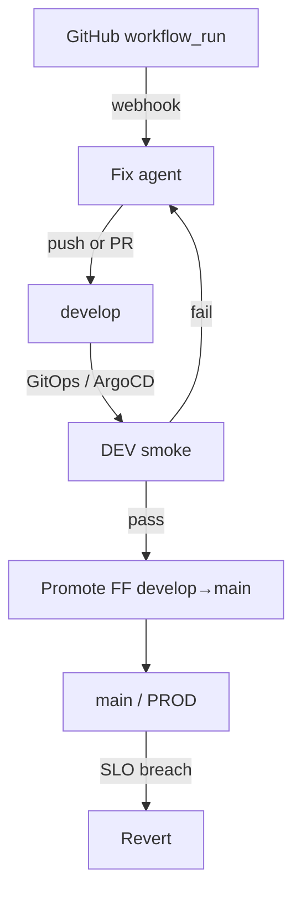

# Optional profiles

The **default install is CI Fix**: GitHub `workflow_run` fail → **Fix**. You do not need Argo, Prometheus, or kubectl for that. See [Getting started](getting-started.md).

This page is the opt-in paved road: CI fail → Fix → GitOps DEV → smoke → Promote → prod SLOs → Revert. Enable it with `xdlc init --profile gitops` or `--profile full` (or by adding gates to an existing `config.yaml`).

## Profiles

| Profile | Command | Gates | What you must already have |
|---------|---------|-------|----------------------------|
| **ci** (default) | `xdlc init` | `ci` | GitHub Actions + agent CLI |
| **gitops** | `xdlc init --profile gitops` | `ci`, `dev-smoke` | ArgoCD app + smoke Job in `dev` |
| **full** | `xdlc init --profile full` | `ci`, `dev-smoke`, `prod-health` | GitOps plus Prometheus or Alertmanager |

Green CI → DEV remains **your** GitOps path. The agent does not invent deploys. It only reacts to gates you list on `repos[].gates`.

## Gate → action (when the gate is enabled)

| Signal | Action |
|--------|--------|
| CI fail (`workflow_run`) | **Fix** |
| DEV smoke fail | **Fix** |
| DEV smoke pass | **Promote** (fast-forward only) |
| Prod p95 / error-rate breach | **Revert** |

## Ordered checklist

**CI Fix (do this first)**

1. [Deployment](deployment.md) — run `xdlc daemon` (Docker/Helm) with durable volume
2. [Configuration](configuration.md) — repos with `gates: [ci]`, agent provider
3. [GitHub webhooks](github-webhooks.md) — App + `workflow_run` → `/webhooks/github`
4. [Fix modes](fix-modes.md) — `direct` or `pr` + agent CLI/keys
5. [Operations](operations.md) — audit, console, upgrades

**GitOps profile (optional)**

6. [GitOps / ArgoCD](gitops-argo.md) — add `dev-smoke`, `argocd_app`, Helm `role.create=true`

**Full profile (optional)**

7. [Prod health](prod-health.md) — PromQL / Alertmanager → revert

## Verification status

Live E2E against real GH / Argo / Prom is tracked separately. A Minikube guestbook + loopback webhooks (`scripts/e2e-local.sh`) does **not** close these issues:

- [#24](https://github.com/xdlc-labs/xdlc-agent/issues/24) GitHub webhook — real org HMAC, job logs, `ci_rerun_before_fix`
- [#25](https://github.com/xdlc-labs/xdlc-agent/issues/25) Argo sync — image tag write-back on real values.yaml, not git FF alone
- [#26](https://github.com/xdlc-labs/xdlc-agent/issues/26) Prom breach — live PromQL poller, not Alertmanager JSON only
- [#27](https://github.com/xdlc-labs/xdlc-agent/issues/27) Fix PR mode — `fix_mode: pr` against GitHub
- [#28](https://github.com/xdlc-labs/xdlc-agent/issues/28) Image / GHCR — chart/image, not a local `bin/xdlc`

Local demo + package tests already cover policy and dispatch shapes — see [Getting started](getting-started.md).
