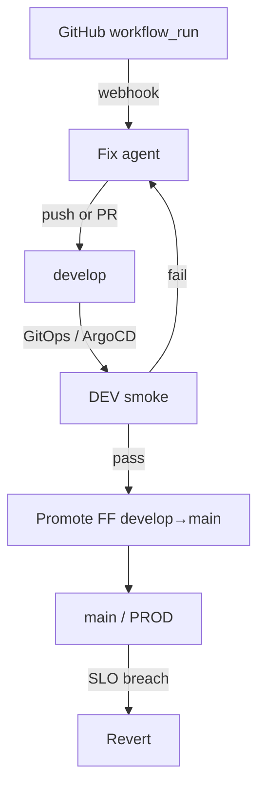

# Production loop

Wire the full paved road: CI fail → Fix → GitOps DEV → smoke → Promote → prod SLOs → Revert.

## Gate → action

| Signal | Action |
|--------|--------|
| CI fail (`workflow_run`) | **Fix** |
| DEV smoke fail | **Fix** |
| DEV smoke pass | **Promote** (fast-forward only) |
| Prod p95 / error-rate breach | **Revert** |

Green CI → DEV remains **your** GitOps path. The agent does not invent deploys.

## Ordered checklist

1. [Deployment](deployment.md) — run `xdlc daemon` (Docker/Helm) with durable volume
2. [Configuration](configuration.md) — repos, gates, agent provider
3. [GitHub webhooks](github-webhooks.md) — App + `workflow_run` → `/webhooks/github`
4. [Fix modes](fix-modes.md) — `direct` or `pr` + agent CLI/keys
5. [GitOps / ArgoCD](gitops-argo.md) — `argocd_app`, smoke, promote
6. [Prod health](prod-health.md) — PromQL / Alertmanager → revert
7. [Operations](operations.md) — audit, console, upgrades

## Verification status

Live E2E against real GH / Argo / Prom is tracked separately:

- [#24](https://github.com/xdlc-labs/xdlc-agent/issues/24) GitHub webhook
- [#25](https://github.com/xdlc-labs/xdlc-agent/issues/25) Argo sync
- [#26](https://github.com/xdlc-labs/xdlc-agent/issues/26) Prom breach
- [#27](https://github.com/xdlc-labs/xdlc-agent/issues/27) Fix PR mode
- [#28](https://github.com/xdlc-labs/xdlc-agent/issues/28) Image / GHCR

Local demo + package tests already cover policy and dispatch shapes — see [Getting started](getting-started.md).
